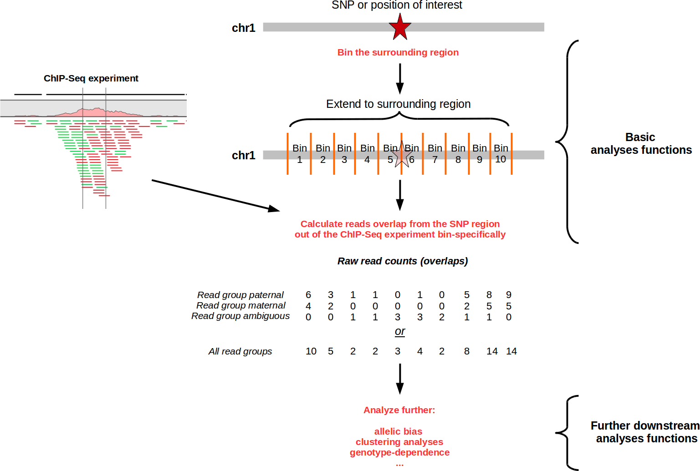
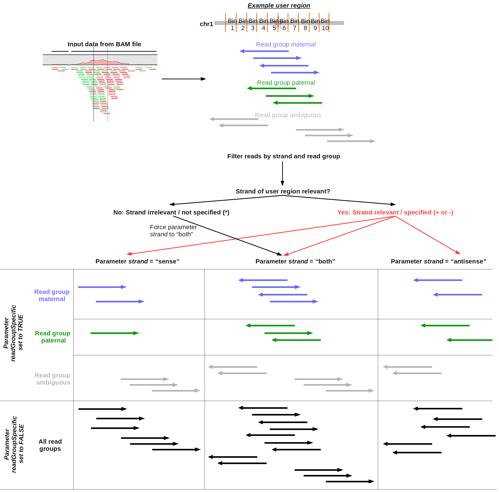

# Motivation, Necessity, Package Scope and Limitations

<a name="section1"></a>

## Motivation and Necessity


<div align="center">
<figure>

<figcaption><i>Figure 1 - *SNPhood* logo.</i></figcaption>
</figure>
</div>
<br/><br/>

To date, thousands of single nucleotide polymorphisms (SNPs) have been found to be associated with complex traits and diseases. However, the vast majority of these disease-associated SNPs lie in the non-coding part of the genome, and are likely to affect regulatory elements, such as enhancers and promoters, rather than the function of a protein. Thus, to understand the molecular mechanisms underlying genetic traits and diseases, it becomes increasingly important to study the effect of a SNP on nearby molecular traits such as chromatin environment or transcription factor (TF) binding. Towards this aim, we developed *SNPhood*, a user-friendly Bioconductor [9] R package to investigate, quantify and visualize the local epigenetic neighborhood of a set of SNPs in terms of chromatin marks, TF binding sites using data from NGS experiments. *SNPhood* comprises a set of easy-to-use functions to extract, normalize and quantify reads for a genomic region, perform data quality checks, normalize read counts using input files, to investigate the binding pattern using unsupervised clustering. In addition, *SNPhood* can be employed for identifying and visualizing allele-specific binding patterns around SNPs using a robust permutation based FDR procedure. The regions around each SNP can be binned in a user-defined fashion to allow for analyses ranging from very broad regions to highly detailed investigation of specific binding shapes. Importantly, *SNPhood* supports the integration with genotype information to investigate and visualize genotype-specific binding patterns.


## Package scope and limitations
<a name="section5"></a>

In this section, we want explicitly mention the designated scope of the *SNPhood* package, its limitations and additional / companion packages that may be used subsequently or beforehand.

First, **let's be clear what *SNPhood* is NOT**:

* *SNPhood* is **NOT a peak caller of ChIP-Seq datasets** and works in an orthogonal manner instead. See below for more details and differences.
* *SNPhood* is **NOT a tool for proper or designated quality control (QC) of ChIP-Seq datasets** and offers only rudimentary QC. For more details and a designated discussion about this issue, see <a href="#section6-4">here</a>.
* *SNPhood* is **NOT a tool for the analysis of Quantitative Trait Loci (QTLs)**. For QTL analyses, designated tools such as WASP [13] or `r CRANpkg("MatrixEQTL")` [14] are available.


**Instead, *SNPhood* aims to fill an existing gap for an increasingly common task**: Current workflows for analyzing ChIP-Seq data typically involve peak calling, which summarizes the signal of each binding event into two numbers: enrichment and peak size, and usually neglects additional factors like binding shape. However, when a set of regions of interest (ROI) is already at hand - e.g. GWAS SNPs, quantitative trait loci (QTLs), etc. - a comprehensive and unbiased analysis of the molecular neighborhood of these regions, potentially in combination with allele-specific (AS) binding analyses will be more suited to investigate the underlying (epi-)genomic regulatory mechanisms than simply comparing peak sizes. Currently, such analyses are often carried out “by hand” using basic NGS tools and genome-browser like interfaces to visualize molecular phenotype data independently for each ROI. A tool for systematic analysis of the local molecular neighborhood of regions of interest is currently lacking.
*SNPhood* fills this gap to investigate, quantify, and visualize the local epigenetic neighborhood of regions of interest using chromatin or TF binding data from NGS experiments. **It provides a set of tools that are largely complimentary to currently existing software for analyzing ChIP-Seq data**.

<div align="center">
<figure>

<figcaption><i>Figure 2 - *SNPhood* feature summary and scope. Comparison and distinction of SNPhood with regard to commonly used tools for ChIP-Seq/RNA-Seq data. Green, yellow and red: Feature fully, partially or not supported, respectively. </i></figcaption>
</figure>
</div>


# Basic Mode of Action
<a name="section2"></a> 

When running the main function *analyzeSNPhood*, a series of steps and calculations is performed.
In summary, the basic mode of action can be summarized in the following schematic:

<div align="center">
<figure>

<figcaption><i>Figure 3 - Basic mode of action of *SNPhood*. See also Figure 4 for a more detailed schematic.</i></figcaption>
</figure>
</div>

<br/><br/>

More specifically, the mode of action and basic workflow is as follows (see also Figure 4):

1. Initiate the analysis and set all parameters accordingly
2. Parse and validate SNPs (or other user defined genomic regions)
3. Split the SNP regions into bins  
4. ITERATE OVER ALL USER-PROVIDED BAM FILES  
    4.1. Perform checks (Index exists, BAM header is parsed, extract read groups)  
    4.2. Parse the BAM file and extract reads overlapping with the SNP regions
    4.3. Determine the genotype distribution at each SNP based on all overlapping reads.
    4.4. Filter reads by strand (if applicable)  
    4.5a. If read group-specific counts have been requested, do the following for each read group:     
        &nbsp;&nbsp;4.5.1. Select only the reads belonging to the particular read group  
        &nbsp;&nbsp;4.5.2. Determine the number of overlaps per region and bin  
        &nbsp;&nbsp;4.5.3. Save (or update, when datasets should be pooled) the read-group specific count matrix for the current dataset (or individual, if datasets are pooled)   
    4.5b. Otherwise, if allele-specific counts have not been requested, do the following:     
        &nbsp;&nbsp;4.5.1. Determine the number of overlaps per region and bin  
        &nbsp;&nbsp;4.5.2. If input normalization has been enabled, repeat 4.1-4.2 and 4.5.1 (b) for the negative control, normalize both libraries, and calculate enrichment of each bin.  
        &nbsp;&nbsp;4.5.3. Save (or update, when datasets should be pooled) the read-group specific count matrix for the current dataset (or individual, if datasets are pooled)  
5. If applicable and requested, normalize the read counts among all count matrices.
6. If provided, integrate matching SNP genotypes.
7. Return the *SNPhood* object that stores all data  


The following Figure is an extension of Figure 2 and depicts in more detail the workflow of the package when running the function *analyzeSNPhood*. In addition, some parameters and their mode of action are highlighted in the step they come into play (depicted in orange).

<div align="center">
<figure>

<figcaption><i>Figure 4 - Basic mode of action of *SNPhood* (extended).</i></figcaption>
</figure>
</div>

# Input
<a name="section3"></a> 

The following input data are required for the *SNPhood* package, which is also visualized in Figure 5:

* One or multiple files in BAM (binary version of a SAM file that contains sequence alignment data) format containing the data for the molecular phenotype. For more details on the BAM format, see [here](http://genome.ucsc.edu/goldenpath/help/bam.html). Each BAM file must be indexed (i.e. an index file with the extension .bai must exist with an identical name as the corresponding BAM file). BAM files must also contain a valid header (i.e. chromosome names, and, if applicable, read groups). To perform allele-specific analyses the reads are required to be assigned a read group that determines whether they mapped better to the paternal or the maternal genome. This information can be obtained by mapping the reads to personal genomes (as described in Kasowski et al. [4], see also [here](https://github.com/sofiakp/ase) for the code on Github)
* Set of genomic SNP positions in BED-like format. For more details on the BED format, see [here](http://genome.ucsc.edu/FAQ/FAQformat.html#format1). For more details on the type of BED files that *SNPhood* supports, see the description of the parameter <a href="#section64">*path_userRegions*</a>.

<div align="center">
<figure>

<figcaption><i>Figure 5 - Supported formats of the user regions file. See section <a href="#section6">*Parameters*</a> for details.</i></figcaption>
</figure>
</div>


* Parameter list: A named list that contains the values of all mandatory parameters for running a *SNPhood* analysis (see below for details). 
* Data frame comprising the files to be processed (column "signal", see below). **Optionally and if applicable**, the following columns and data are supported and can be integrated:
    * "input": files containing input signal (input DNA w/o antibody as provided by most ChIP-Seq experiments) for normalization purposes. Multiple input files can be used (see example below). Set to NA if no input is available.
    * "individual": name of the individual. All files with the same individual ID (e.g. biological replicates) will be treated as one dataset by combining the read count information. Set to NA or assign a unique value for each file if all files should be treated separately.
    * "genotype": path to the genotype file in VCF format (see below for a more detailed description), followed by a ":" and the name of the column in the VCF file.

The following data frames are all valid as input for *SNPhood* and its main function *analyzeSNPhood*:
```{r, results='asis',echo=FALSE}

files.df   = data.frame(signal = c("file1.bam", "file2.bam","file3.bam"),
                        input = NA,
                        stringsAsFactors = FALSE)
knitr::kable(files.df)

cat("\n\n")


files.df   = data.frame(signal = c("file1.bam", "file2.bam","file3.bam"),
                        input = c("input1.bam","input1.bam","input2.bam, input3.bam"), 
                        individual = c("S1","S1","S2"), 
                        genotype = c("file1.vcf:colName1","file1.vcf:colName1","file1.vcf:colName2"),
                        stringsAsFactors = FALSE)
knitr::kable(files.df)
```

In summary, the following data can be integrated into *SNPhood*:

<div align="center">
<figure>

<figcaption><i>Figure 6 - Schematics of the input data that are required or optional in *SNPhood*.</i></figcaption>
</figure>
</div>


# Output
<a name="section4"></a> 

The main function *analyzeSNPhood* returns an object of the class *SNPhood*. It contains all information and results necessary for subsequent analyses and visualization. For details on the structure of the object and how to extract information, see the help pages for *SNPhood-class* (?"SNPhood-class") or the *SNPhood* package itself (?SNPhood).

# Further Methodological Details
<a name="section5"></a> 

We now explain various additional methodological and technical details in more detail.


## Plots

All plots are generated with `r CRANpkg("ggplot2")` [8] and are either saved directly in the *SNPhood* object that serves as input for the respective plotting function or returned by the function so that users can modify and replot them as desired. See the help pages of the plotting functions for details. To edit plots, save them in a variable (e.g., plot = plotBinCounts(...)) and either edit them directly by modifying the internal structure of the ggplot list object (e.g., plot$labels$colour = "NEW LEGEND LABEL" to change the legend label) or by adding features in the usual ggplot style, such as plot + geom_lines(...) .

## Parameters

*SNPhood* requires a number of parameters that are specified in a named list that is needed for the execution of the main function *analyzeSNPhood*. A default parameter list can be obtained by calling the function *getDefaultParameterList*.

We explain the supported parameters in more detail in the section "Parameters" (see below).

## Input files

*SNPhood* supports files in BAM format. All BAM files must contain aligned reads and a valid header with, for example, chromosome names and read groups (if applicable). If a corresponding index file with the file ending .bai does not exist for a particular BAM file, it will be created during execution of the main function.

Note that if you already have your BAM files represented in an object of class *BamFile* or *BamFileList* from the `r Biocpkg("Rsamtools")` package, this can easily be integrated into the *SNPhood* framework. See the help pages of the function *collectFiles* for details.


## Quality control (QC)
<a name="section6-4"></a>

As discussed <a href="#section5">beforehand</a>, ***SNPhood* is not suitable for ChIP-Seq QC** and has never been designed as such. It is important to assess potential biases such as GC, mapping, contamination or other biases beforehand using dedicated tools both within and outside the Bioconductor framework. Example packages from Bioconductor include `r Biocpkg("htSeqTools")`, `r Biocpkg("ChIPQC")`, `r Biocpkg("similaRpeak")` or `r Biocpkg("chipseq")` (see <a href="https://www.bioconductor.org/packages/release/BiocViews.html#">Bioconductor</a> for a complete list).
Alternatively, external software such as *FASTQC* [11] or *Chance* [12] may also be used.

Nevertheless, *SNPhood* offers some rudimentary QC mechanisms that accompany designated QC tools:

* the user can specifically decide which reads from the input files should be included based on their flags, thereby allowing to exclude reads with poor quality. For more details, see <a href="#section6-6">here</a>.
* the designated QC function *plotAndCalculateCorrelationDatasets* may be used to identify datasets that are weakly correlated with other datasets given the user-defined regions of interest based on pairwise correlation of the raw read values (i.e., the number of reads that overlap each region of interest). For example, one would usually expect that the correlation coefficients are very high among replicate samples and relatively high among different samples as well. For more details, see also the R help of the function and the workflow vignette.


## Extending user regions and binning
<a name="section5-3"></a> 


The user-provided genomic positions can be extended symmetrically in both 5' and 3' direction to analyze their "neighborhood". The extension size can be set with the parameter *regionSize*. As an example: for a SNP at position chr1:1000 and parameter *regionSize* set to 500, the region will be extended 500bp in both directions, yielding the region chr1:[500-1500] of length 500+1+500 = 1001.

To assess the binding pattern within each genomic region in more detail they can be binned in a user-defined fashion. The length of each bin is controled by the parameter *binSize* (see below). Note that for now each region is treated identically and it is not possible to use different binning schemes within one *SNPhood* object.
Binning always starts at the position with the lowest genomic coordinate (i.e. left of the original position). So setting *binSize* to 100 for our example region above the bins will be: 500-599, 600-699, ..., 1400-1499, 1500-1500. Note that in this particular case, the last bin is only 1 bp short (see next paragraph).

Since the last bin can be of a different size than the othes (depending on the values of the parameter combination *regionSize* and *binSize*) the parameter the user can specify how it should be treated by setting the parameter *lastBinTreatment* (see below for details). In the example given above, to maintain symmetry of the region with respect to the original user-defined position, it might be the most useful option to delete the last bin.

Read counts (and enrichment values, if applicable) are calculated specifically for each bin.


## Read extraction

Read extraction for the binned user regions is done using the `r Biocpkg("Rsamtools")` package. Noteworthy, for increased flexibility and in analogy to read extraction in the `r Biocpkg("Rsamtools")` package, it is possible to extract only reads with particular BAM flags (e.g. not marked as PCR duplicate, passed quality controls, have a properly aligned mate, etc). Read flags can be set using the parameters starting with *readFlag_* accordingly. In addition, the parameters *strand*, *readGroupSpecific*, *readFlag_reverseComplement*, and *readFlag_simpleCigar* allow additional control over which reads are returned (see the `r Biocpkg("Rsamtools")` package and below for more details). If the parameter *strand* is set to *sense* or *antisense* and the original user regions have been specified strand-specifically, for example, reads are filtered according to the value of  *strand*. For a graphical depiction, see also Figure 7.

Note that read extraction out of BAM files can be time-consuming, especially if the number of user regions is large or if a high number of reads overlap with the user regions.

<div align="center">
<figure>

<figcaption><i>Figure 7 - Schematics of how read filtering with respect to strand and read groups is performed in *SNPhood*.</i></figcaption>
</figure>
</div>


## Determination of SNP genotypes

For each SNP, the read-group (e.g. most commonly specifying whether a read was mapped to the maternal or paternal genome) specific genotype distribution can be determined (see Figure 7). To determine the genotype distribution, all reads overlapping the SNP positions are extracted from the BAM files and the genotype distribution is determined using the `r Biocpkg("Biostrings")` package.
The genotypes can then be used in various visualizations (see the different plot functions that the package provides) to detect a genotype-dependent pattern.

<div align="center">
<figure>

<figcaption><i>Figure 8 - Schematics of how the genotype distribution for the user positions (e.g, SNPs) is determined.</i></figcaption>
</figure>
</div>

## Normalization of reads counts and enrichment calculation

Raw read counts among datasets can be misleading and are difficult to compare. To make reads comparable across individuals, *SNPhood* currently provides two different normalization procedures: 

1. Normalization using input DNA: this will correct not only across samples but also for the accessibility of a given region and will allow a comparison across regions. This method requires that input DNA has been sequenced deep enough to provide a decent coverage across the entire genome. It is analogous to the input normalization by commonly used peak callers such as MACS2 [7].
2. Normalization by library size:  this will only correct for library size and thus allow a comparison across libraries. Note that a comparison across regions is not necessarly valid since regions can differ in their accessibility. 


### Normalizing using negative controls (e.g. input DNA): 

Proper normalization between the ChIP and control samples particularly important when comparing across regions in the genome as the DNA accessibility differs between open and closed chromatin, which will be reflected in the number of "noise" reads obtained from those regions. If negative control files (such as input, IgG) are available, they can be integrated into the *SNPhood* package to normalize read counts and calculate enrichments for each user region. 

Normalizing read counts by input is possible when the following criteria are met:

* the parameter *normByInput* is set to TRUE
* the parameter *readGroupSpecific* is set to FALSE
* input files have been specified for **all** files that are processed

Note that if this normalization is performed, this overrides the value of the parameter *normAmongEachOther* to FALSE because this is already integrated within the input normalization procedure.

Specifically, input normalization works as follows. First, read counts between input and signal are normalized to account for differences in library size (see below for details). Thus, the resulting enrichment is based on the normalized and **not** the raw read counts (i.e., after applying a correction by size factors using the `r Biocpkg("DeSeq2")` [3] package, see next section) for both input and signal. Second, for each bin of each SNP region, the maximum of the following three numbers is taken as basis for calculating the enrichment:

* the average number of input reads per bin **across all user regions** 
* the average number of input reads per bin **for that particular user region**
* the number of input reads for the specific bin

The maximum of these three values (after normalization) is then compared to the normalized number of reads per bin in the signal file and an enrichment is calculated. This is similar to the normalization implement in the *MACS2* peak caller [7]; it avoids inflating small read counts from input and corrects local biases caused by DNA accessibility.


The following illustration summarizes how input normalization is performed for each bin and user region:

<div align="center">
<figure>

<figcaption><i>Figure 9 - Schematics of how the input normalization works. See text for details.</i></figcaption>
</figure>
</div>


### Normalizing by library size only

If no negative control is available we recommend a normalization by library size so that different samples can be compared among each other. This normalization can be performed among all processed files by setting the parameter *normAmongEachOther* to TRUE. Note that if only one dataset is present in the analysis, there is no need for this type of normalization.

Converting raw read counts to normalized read counts is possible when the following criteria are met:

* the parameter *normAmongEachOther* is set to TRUE
* the parameter *readGroupSpecific* is set to FALSE
* the parameter *normByInput* is set to FALSE (i.e., input normalization is not performed)

After this normalization, read counts are numeric values that reflect the normalized read counts among all processed files.

The normalization is done using the `r Biocpkg("DeSeq2")` package by creating a virtual sample and determining size factors for each library that reflect the normalization factor, based on the total number of read counts per user region (i.e., before binning). For more details, see the `r Biocpkg("DeSeq2")` package and Love et al. (2014) [3].


## Allelic bias tests


The function *testForAllelicBiases*  performs a statistical test to test for allelic biases given the read counts of two read groups (e.g., maternal vs. paternal). The prerequisite for this type of analysis is that the reads have been reliably mapped to the paternal and maternal genome (e.g. as described in Kasowski et al. [4]). This task is not trivial and not in the scope of *SNPhood*, which is why dedicated external tools must be used.


To determine the significance across regions, one can select the lowest p-value for each region. This ensures to select the bin with the most power (which often has the highest number of reads) to detect allelic bias. However, the tests for bins are not independent from one another and the p-values are not adjusted for multiple testing. For this reason, we emphasize that the obtained p-values should not be used as anything else than a test statistic (see below). 

We therefore implemented a permutation-based procedure to control the false discovery rate (FDR). In summary, we use the p-values from the binomial test as a test statistic to calculate the FDR with a random background model rather than directly, and our approach is therefore conceptually similar to what was done in Alexandrov et al. 2013 [15], section "Statistical analysis of relationships between age and mutations". Thus, due to the fact that overdispersion affects both our real and shuffled data, it is likely that our procedure is rather too pessimistic than too optimistic in discovering allelic bias. More specifically, for each bin, we generate an empirical p-value distribution by randomly but equally assigning each overlapping read to one of the two read groups, perform a binomial test and select the most significant p-value for each region. For a given p-value threshold the FDR is then calculated as the fraction of significant regions identified from the random by the total number of significant regions. Finally, we note that the FDR calculation is based on the full set of user regions.

As an output, the raw p-values from the binomial tests, estimates for the allelic fraction and corresponding confidence intervals are reported for each bin across all user regions. In addition, the corresponding FDR values for a user-defined set of p-values is also given that may then be used to select only regions that fulfill a user-defined condition based on FDR preferences.


## Genotype integration

We currently support two ways of integrating genotypes with user regions (e.g., SNPs):

1. Integrate the genotypes at the beginning when calling the function *analyzeSNPhood* by providing the necessary information in the column "genotypes". For more details, see the help pages.
2. Integrate the genotype later, after the creation of the *SNPhood* object, by calling the function *associateGenotypes*. For more details, see the help pages.

For each dataset/individual in a *SNPhood* object, a file in VCF format may be used to associate genotypes for each SNP region. For more details on the VCF format, see [here](http://samtools.github.io/hts-specs/VCFv4.2.pdf).

Parsing VCF files is done using the `r Biocpkg("VariantAnnotation")` package, which supports both uncompressed and compressed (gzipped, file ending .gz) VCF files that comply with the VCF standard (e.g. as used by the *1000 Genomes Project* [5]). 

Matching is done by position rather than ID of the SNPs, and SNP positions from the *SNPhood* object not defined in the corresponding VCF file will have a genotype of NA. Non-matching rows from the VCF file are discarded and not imported. The column names (i.e., the IDs of the individuals to extract the genotypes from) must also be provided.


## Clustering

*SNPhood* provides some clustering functionalities to cluster SNPs based on their local neighbourhood. Clustering can be done on both counts or enrichments, dependent on the type of data stored in the *SNPhood* object. Data from any of the defined read groups and datasets can be used for this purpose.

The underlying clustering is done using partitioning around medoids (PAM), which is implemented in the `r Biocpkg("cluster")` package. PAM clustering is more robust than k-means clustering as the algorithm minimizes the sum of dissimilarities instead of a sum of squared Euclidean distances.

To compare and cluster different datasets, and in particular, to compare the shape of binding across the different SNPs within one or several data sets, we implemented a standardisation procedure across the bins for each SNP (i.e. subtracting the mean dividing by standard deviation for each SNP). This allows the investigation of the binding shape irrespective of the overall signal intensity.

Several plotting functions are available to investigate the clusters, see the help pages for details.

An additional feature that might be useful when performing clustering on several individuals is to group individuals for each SNP according to their genotype, which we divide into strong and weak genotypes. They are determined based on the signal obtained for the different genotypes (see help pages of the function *calculateWeakAndStrongGenotype*). One can then perform the clustering only on the signal averaged across all high-genotype individuals at each SNP to increase the signal to noise ratio (analogous to the analysis in Figure 6 in Grubert et al. [6]).


# Parameters
<a name="section6"></a> 


## Performance options

**nCores**

*Description*: The number of cores that should be used for computationally demanding and parallelizable tasks: the more cores the smaller the total running time. However, note that the decrease in running time is not necessarily linear because not all computationally intensive tasks can be executed in parallel.

*Valid values*: any positive integer larger than 0 and smaller than the number of available cores

*Default value*: 1

**keepAllReadCounts**

*Description*: If TRUE all count matrices from datasets with the same individual ID will be stored within the *SNPhood* object after pooling datasets. This parameter is only relevant if the parameter *poolDatasets* is set to TRUE and will be ignored otherwise. Setting it to FALSE (the default) can save a considerable amount of space (decreased memory consumption) but makes it impossible to analyze and visualize read counts for the original datasets. This will onyl be possible for the pooled datasets, as given by their individual ID.

*Valid values*: TRUE or FALSE

*Default value*: FALSE


## Normalization

**normByInput**

*Description*:  If TRUE input normalization will be performed. This is highly recommended but requires that appropriate input files are available (e.g., a BAM file with input DNA reads).

*Valid values*: TRUE or FALSE

*Default value*: TRUE


**normAmongEachOther**

*Description*: Only applicable when when analysing multiple datasets. If TRUE all datasets will be normalized among each other, i.e. the read counts of all processed files will be normalized using the size factor normalization in the `r Biocpkg("DeSeq2")` package.

*Valid values*: TRUE or FALSE

*Default value*: TRUE


**poolDatasets**

*Description*: To maximize the power to detect allelic biases at particular sites, for example, multiple datasets can be pooled (i.e., combined) to a "meta" dataset. If set to TRUE, all datasets with the same individual ID are pooled and therefore are merged to one dataset (that is, their read counts are summed up). Biological replicates, for example, are typically pooled to increase the power to detect allelic biases.   

*Valid values*: TRUE or FALSE

*Default value*: TRUE


## Read retrieval options

**strand** 

*Description*:  Should reads be counted regardless of the strand from the original SNP position ("BOTH"), only if they are in sense direction to the region of interest ("SENSE") or only antisense ("ANTISENSE")? To retrieve reads regardless of the strand, use the option "both". If the strand in the user regions file is not provided, or if it is "*" or ".", reads will be retrieved regardless of the strand.

*Valid values*: SENSE or ANTISENSE or BOTH

*Default value*: BOTH


**readGroupSpecific**

*Description*:  In BAM files, @RG tags can be defined, which allows grouping a set of reads from different experiments, alleles, origins, etc. Each read is associated with one specific read group. The parameter *readGroupSpecific* determines if read counts will be analyzed individually for each read group as specified in the BAM file. If set to TRUE, any input normalization will be turned off, and only read counts are returned but no enrichments due to the lack of input normalization. If set to FALSE, the defined read groups will be ignored and counts and enrichments are calculated regardless of the read group. This is particularly useful if read groups provide information about whether a read was mapped to the 'maternal' or 'paternal' genome, and required for allele-specific analyses.

*Valid values*: TRUE or FALSE

*Default value*: FALSE


**readFlag_isPaired**

*Description*:  A logical(1) indicating whether unpaired (FALSE), paired (TRUE), or any (NA) read should be returned. See the Rsamtools package in R for more information.

*Valid values*: TRUE or FALSE or NA

*Default value*: TRUE 


**readFlag_isProperPair**

*Description*:  A logical(1) indicating whether improperly paired (FALSE), properly paired (TRUE), or any (NA) read should be returned. A properly paired read is defined by the alignment algorithm and might, e.g., represent reads aligning to identical reference sequences and with a specified distance. See the Rsamtools package in R for more information.

*Valid values*: TRUE or FALSE or NA

*Default value*: TRUE 


**readFlag_isUnmappedQuery**

*Description*:  A logical(1) indicating whether unmapped (TRUE), mapped (FALSE), or any (NA) read should be returned. See the Rsamtools package in R for more information.

*Valid values*: TRUE or FALSE or NA

*Default value*: FALSE


**readFlag_hasUnmappedMate**

*Description*:  A logical(1) indicating whether reads with mapped (FALSE), unmapped (TRUE), or any (NA) mate should be returned. See the Rsamtools package in R for more information.

*Valid values*: TRUE or FALSE or NA

*Default value*: FALSE


**readFlag_isMinusStrand** 

*Description*:  A logical(1) indicating whether reads aligned to the plus (FALSE), minus (TRUE), or any (NA) strand should be returned. See the Rsamtools package in R for more information.

*Valid values*: TRUE or FALSE or NA

*Default value*: NA 


**readFlag_isMateMinusStrand** 

*Description*:  A logical(1) indicating whether mate reads aligned to the plus (FALSE), minus (TRUE), or any (NA) strand should be returned. See the Rsamtools package in R for more information.

*Valid values*: TRUE or FALSE or NA

*Default value*: NA 


**readFlag_isFirstMateRead**

*Description*:  A logical(1) indicating whether the first mate read should be returned (TRUE) or not (FALSE), or whether mate read number should be ignored (NA). See the Rsamtools package in R for more information.

*Valid values*: TRUE or FALSE or NA

*Default value*:  NA


**readFlag_isSecondMateRead**

*Description*:  A logical(1) indicating whether the second mate read should be returned (TRUE) or not (FALSE), or whether mate read number should be ignored (NA). See the Rsamtools package in R for more information.

*Valid values*: TRUE or FALSE or NA

*Default value*: NA


**readFlag_isNotPrimaryRead**

*Description*:  A logical(1) indicating whether alignments that are primary (FALSE), are not primary (TRUE) or whose primary status does not matter (NA) should be returned. A non-primary alignment (“secondary alignment” in the SAM specification) might result when a read aligns to multiple locations. One alignment is designated as primary and has this flag set to FALSE; the remainder, for which this flag is TRUE, are designated by the aligner as secondary. See the Rsamtools package in R for more information.

*Valid values*: TRUE or FALSE or NA

*Default value*: FALSE


**readFlag_isNotPassingQualityControls**

*Description*:  A logical(1) indicating whether reads passing quality controls (FALSE), reads not passing quality controls (TRUE), or any (NA) read should be returned. See the Rsamtools package in R for more information.

*Valid values*: TRUE or FALSE or NA

*Default value*: FALSE


**readFlag_isDuplicate**

*Description*:   logical(1) indicating that un-duplicated (FALSE), duplicated (TRUE), or any (NA) reads should be returned. 'Duplicated' reads may represent PCR or optical duplicates. See the Rsamtools package in R for more information.

*Valid values*: TRUE or FALSE or NA

*Default value*: FALSE


**readFlag_reverseComplement** 

*Description*:  A logical(1) vectors. BAM files store reads mapping to the minus strand as though they are on the plus strand. Rsamtools obeys this convention by default (reverseComplement=FALSE), but when this value is set to TRUE returns the sequence and quality scores of reads mapped to the minus strand in the reverse complement (sequence) and reverse (quality) of the read as stored in the BAM file. This might be useful if wishing to recover read and quality scores as represented in fastq files, but is NOT appropriate for variant calling or other alignment-based operations. See the Rsamtools package in R for more information.

*Valid values*: TRUE or FALSE

*Default value*: FALSE


**readFlag_simpleCigar**

*Description*:  A logical(1) vector which, when TRUE, returns only those reads for which the cigar (run-length encoded representation of the alignment) is missing or contains only matches / mismatches ('M'). See the Rsamtools package in R for more information.

*Valid values*: TRUE or FALSE

*Default value*: FALSE

## User regions options

<a name="section64"></a> 

**path_userRegions**

*Description*:  Path to a BED file with a set of user regions for which read counts or enrichment values should be obtained. Supported are regular BED files with with TAB as column separator and 6 columns: chromosome (format: integers only or of type chr*), start (format: integers), end (format: integers), annotation (format: character), score (format: integer, will be ignored), and strand (format: one of [+-*.]). **Note that the order of the columns is very important**. 

For user convenience, the following additional BED-like formats with fewer columns are supported and automatically recognized according to their total number of columns: 5 columns BED file (chromosome, start, end, annotation, strand), 4 columns BED file (chromosome, start, end, annotation), 3 columns BED file (chromosome, SNP position, annotation) and 2 columns BED file (chromosome, SNP position). See also the section input above for a visual summary of supported formats.


*Valid values*: a valid path to the file

*Default value*: none


**assemblyVersion**

*Description*:  Genome assembly version. See valid values for a list of currently supported genome assemblies. 

*Valid values*: hg18, hg19, hg38, mm9, mm10, dm3, sacCer3, and sacCer2 are supported. Click <a href="#section8">here</a> to contact us if you need additional genomes.

*Default value*:  hg19


**headerLine**

*Description*:  Does the user regions file contain a header line? If set to TRUE, the first line will be skipped.

*Valid values*: TRUE or FALSE

*Default value*: TRUE 


**linesToParse**

*Description*:  For test purposes, use only the first X lines instead of the full file. Set to -1 to read in the full file.
	
*Valid values*: any positive integer value or -1

*Default value*: -1


**regionSize** 

*Description*:  This parameter determines the size of the user regions (in bp). The user-provided positions will be extended by this value on both sides, so that the entire region will be of size:2* *regionSize*  + 1 because the original user position is also included. For more details, see <a href="section5-3">*Extending user regions and binning*</a>.


*Valid values*: any positive integer value

*Default value*: 500 


**binSize**

*Description*:  Size (in bp) of each bin. The full user region is binned equally according to the value of *binSize*. For more details, see the section 
*Extending user regions and binning*. 
*Valid values*: any positive integer value between 1 and *regionSize* (see above)

*Default value*: 10


**lastBinTreatment**

*Description*:  The last bin in each region may be shorter than the other bins due to the specific settings of the parameters *regionSize* and *binSize*. Should the last bin be left untouched ("KEEPUNCHANGED"), deleted ("DELETE"), or extended to the bin size of the other bins ("EXTEND")? 

*Valid values*: KEEPUNCHANGED, DELETE or EXTEND

*Default value*: KEEPUNCHANGED

**zeroBasedCoordinates** 

*Description*:  By default, bases in BED files are zero-based. If not, set this parameter to FALSE, and positions will be converted to a zero-based format (i.e., positions will be decreased by one).

*Valid values*: TRUE or FALSE

*Default value*: TRUE 

**startOpen** and **endOpen**

*Description*:  The convention for BED files is a half-open format (*startOpen* = FALSE and *endOpen* = TRUE). That is, the last base is not included in the feature while the first one is (example: 100-101 for a SNP located at position 100). However, fully closed intervals are common as well (example: 100-100). Internally, all positions are converted to a fully closed interval but for user convenience, this does not need to be done manually.

*Valid values*: TRUE or FALSE

*Default value*: FALSE


# Example Workflow
<a name="section7"></a> 

For a detailed example workflow, see the workflow vignette [exampleWorkflow](exampleWorkflow.html).


# Bug Reports, Feature Requests and Contact Information
<a name="section8"></a> 

We value all the feedback that we receive and will try to reply in a timely manner.

Please report any bug that you encounter as well as any feature request that you may have to <a href="mailto:SNPhood@gmail.com?Subject=SNPhood package" target="_top">SNPhood@gmail.com</a>.


# References
<a name="section9"></a> 

[1] R Core Team (2014). R: A language and environment for statistical computing. R Foundation for Statistical Computing, Vienna, Austria. URL  http://www.R-project.org/

[2] Morgan M, Pagès H, Obenchain V and Hayden N. Rsamtools: Binary alignment (BAM), FASTA, variant call (BCF), and tabix file import. R package version 1.18.2, http://bioconductor.org/packages/release/bioc/html/Rsamtools.html. 

[3] Love, M. I., Huber, W., & Anders, S. (2014). Moderated estimation of fold change and dispersion for RNA-seq data with DESeq2. Genome Biol, 15(12), 550.

[4] Kasowski, M., Kyriazopoulou-Panagiotopoulou, S., Grubert, F., Zaugg, J. B., Kundaje, A., Liu, Y., ... & Snyder, M. (2013). Extensive variation in chromatin states across humans. Science, 342(6159), 750-752.

[5] 1000 Genomes Project Consortium. (2010). A map of human genome variation from population-scale sequencing. Nature, 467(7319), 1061-1073.

[6] Grubert, F., Zaugg, J. B., Kasowski, M., Ursu, O., Spacek, D. V., Martin, A. R., ... & Snyder, M. (2015). Genetic Control of Chromatin States in Humans Involves Local and Distal Chromosomal Interactions. Cell, 162(5), 1051-1065.

[7] Zhang, Y., Liu, T., Meyer, C. A., Eeckhoute, J., Johnson, D. S., Bernstein, B. E., ... & Liu, X. S. (2008). Model-based analysis of ChIP-Seq (MACS). Genome biology, 9(9), R137.

[8] Wickham, H. (2009). ggplot2: elegant graphics for data analysis. Springer Science & Business Media.

[9] Huber, W., Carey, V. J., Gentleman, R., Anders, S., Carlson, M., Carvalho, B. S., ... & Morgan, M. (2015). Orchestrating high-throughput genomic analysis with Bioconductor. Nature methods, 12(2), 115-121.

[10] Koehler, R., Issac, H., Cloonan, N., & Grimmond, S. M. (2011). The uniqueome: a mappability resource for short-tag sequencing. Bioinformatics, 27(2), 272-274.

[11] Andrews, S. (2010). FastQC: A quality control tool for high throughput sequence data. Reference Source.

[12] Diaz, A., Nellore, A., & Song, J. S. (2012). CHANCE: comprehensive software for quality control and validation of ChIP-seq data. Genome Biol, 13(10), R98.

[13] van de Geijn, B., McVicker, G., Gilad, Y., & Pritchard, J. (2014). WASP: allele-specific software for robust discovery of molecular quantitative trait loci. bioRxiv, 011221.

[14] Shabalin, A. A. (2012). Matrix eQTL: ultra fast eQTL analysis via large matrix operations. Bioinformatics, 28(10), 1353-1358.

[15] Alexandrov, L. B., Nik-Zainal, S., Wedge, D. C., Aparicio, S. A., Behjati, S., Biankin, A. V., ... & Boyault, S. (2013). Signatures of mutational processes in human cancer. Nature, 500(7463), 415-421.

